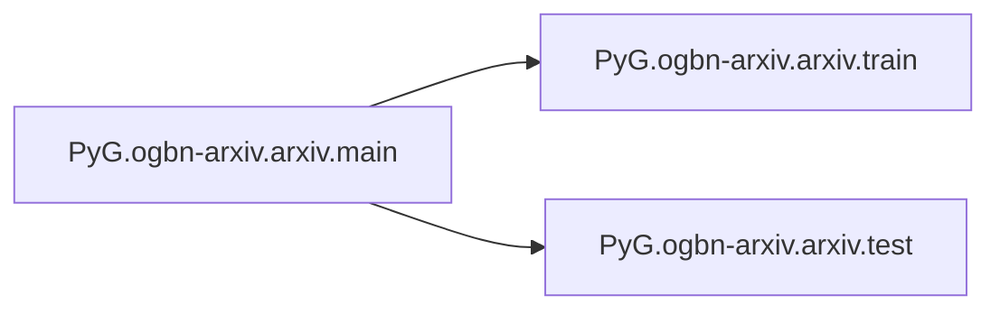

# Pyg Ogbn-arxiv

[_Documentation generated by Documatic_](https://www.documatic.com)

<!---Documatic-section-Codebase Structure-start--->
## Codebase Structure

<!---Documatic-block-system_architecture-start--->
```mermaid
None
```
<!---Documatic-block-system_architecture-end--->

# #
<!---Documatic-section-Codebase Structure-end--->

<!---Documatic-section-PyG.ogbn_arxiv.layer.gcn_norm-start--->
## PyG.ogbn-arxiv.layer.gcn_norm

<!---Documatic-section-gcn_norm-start--->
<!---Documatic-block-PyG.ogbn_arxiv.layer.gcn_norm-start--->
<details>
	<summary><code>PyG.ogbn_arxiv.layer.gcn_norm</code> code snippet</summary>

```python
@torch.jit._overload
def gcn_norm(edge_index, edge_weight=None, num_nodes=None, improved=False, add_self_loops=True, dtype=None):
    pass
```
</details>
<!---Documatic-block-PyG.ogbn_arxiv.layer.gcn_norm-end--->
<!---Documatic-section-gcn_norm-end--->

# #
<!---Documatic-section-PyG.ogbn_arxiv.layer.gcn_norm-end--->

<!---Documatic-section-PyG.ogbn_arxiv.arxiv.train-start--->
## PyG.ogbn-arxiv.arxiv.train

<!---Documatic-section-train-start--->
<!---Documatic-block-PyG.ogbn_arxiv.arxiv.train-start--->
<details>
	<summary><code>PyG.ogbn_arxiv.arxiv.train</code> code snippet</summary>

```python
def train(model, data, train_idx, optimizer):
    model.train()
    optimizer.zero_grad()
    pred = model(data)[train_idx]
    loss = F.nll_loss(pred, data.y.squeeze(1)[train_idx])
    loss.backward()
    optimizer.step()
    return loss.item()
```
</details>
<!---Documatic-block-PyG.ogbn_arxiv.arxiv.train-end--->
<!---Documatic-section-train-end--->

# #
<!---Documatic-section-PyG.ogbn_arxiv.arxiv.train-end--->

<!---Documatic-section-PyG.ogbn_arxiv.arxiv.test-start--->
## PyG.ogbn-arxiv.arxiv.test

<!---Documatic-section-test-start--->
<!---Documatic-block-PyG.ogbn_arxiv.arxiv.test-start--->
<details>
	<summary><code>PyG.ogbn_arxiv.arxiv.test</code> code snippet</summary>

```python
@torch.no_grad()
def test(model, data, y_true, split_idx, evaluator):
    model.eval()
    out = model(data)
    y_pred = out.argmax(dim=-1, keepdim=True)
    train_acc = evaluator.eval({'y_true': y_true[split_idx['train']], 'y_pred': y_pred[split_idx['train']]})['acc']
    valid_acc = evaluator.eval({'y_true': y_true[split_idx['valid']], 'y_pred': y_pred[split_idx['valid']]})['acc']
    test_acc = evaluator.eval({'y_true': y_true[split_idx['test']], 'y_pred': y_pred[split_idx['test']]})['acc']
    return (train_acc, valid_acc, test_acc)
```
</details>
<!---Documatic-block-PyG.ogbn_arxiv.arxiv.test-end--->
<!---Documatic-section-test-end--->

# #
<!---Documatic-section-PyG.ogbn_arxiv.arxiv.test-end--->

<!---Documatic-section-PyG.ogbn_arxiv.arxiv.main-start--->
## PyG.ogbn-arxiv.arxiv.main

<!---Documatic-section-main-start--->


### Object Calls

* PyG.ogbn-arxiv.arxiv.train
* PyG.ogbn-arxiv.arxiv.test

<!---Documatic-block-PyG.ogbn_arxiv.arxiv.main-start--->
<details>
	<summary><code>PyG.ogbn_arxiv.arxiv.main</code> code snippet</summary>

```python
def main():
    parser = argparse.ArgumentParser(description='OGBN-Arxiv (Full-Batch)')
    parser.add_argument('--device', type=int, default=1)
    parser.add_argument('--log_steps', type=int, default=10)
    parser.add_argument('--num_layers', type=int, default=16)
    parser.add_argument('--hidden_channels', type=int, default=256)
    parser.add_argument('--dropout', type=float, default=0.1)
    parser.add_argument('--weight_decay', type=float, default=0, help='weight decay (L2 loss on parameters).')
    parser.add_argument('--lr', type=float, default=0.001)
    parser.add_argument('--epochs', type=int, default=1000)
    parser.add_argument('--runs', type=int, default=10)
    parser.add_argument('--patience', type=int, default=200, help='patience')
    parser.add_argument('--alpha', type=float, default=0.5, help='alpha_l')
    parser.add_argument('--norm', default='bn', help='norm layer.')
    args = parser.parse_args()
    print(args)
    device = f'cuda:{args.device}' if torch.cuda.is_available() else 'cpu'
    device = torch.device(device)
    dataset = PygNodePropPredDataset(name='ogbn-arxiv')
    split_idx = dataset.get_idx_split()
    data = dataset[0]
    data = data.to(device)
    train_idx = split_idx['train'].to(device)
    data.edge_index = to_undirected(data.edge_index, data.num_nodes)
    Net = GCNIIdense_model
    evaluator = Evaluator(name='ogbn-arxiv')
    acc_list = []
    for run in range(args.runs):
        model = Net(data.x.size(-1), args.hidden_channels, dataset.num_classes, args.num_layers, args.dropout, args.alpha, args.norm).to(device)
        optimizer = torch.optim.Adam(model.parameters(), lr=args.lr, weight_decay=args.weight_decay)
        bad_counter = 0
        best_val = 0
        final_test_acc = 0
        for epoch in range(1, 1 + args.epochs):
            loss = train(model, data, train_idx, optimizer)
            result = test(model, data, data.y, split_idx, evaluator)
            (train_acc, valid_acc, test_acc) = result
            if epoch % args.log_steps == 0:
                (train_acc, valid_acc, test_acc) = result
                print(f'Run: {run + 1:02d}, Epoch: {epoch:02d}, Loss: {loss:.4f}, Train: {100 * train_acc:.2f}%, Valid: {100 * valid_acc:.2f}% Test: {100 * test_acc:.2f}%')
            if valid_acc > best_val:
                best_val = valid_acc
                final_test_acc = test_acc
                bad_counter = 0
            else:
                bad_counter += 1
            if bad_counter == args.patience:
                break
        acc_list.append(final_test_acc * 100)
        print(run + 1, ':', acc_list[-1])
    acc_list = torch.tensor(acc_list)
    print(f'Avg Test: {acc_list.mean():.2f} ± {acc_list.std():.2f}')
```
</details>
<!---Documatic-block-PyG.ogbn_arxiv.arxiv.main-end--->
<!---Documatic-section-main-end--->

# #
<!---Documatic-section-PyG.ogbn_arxiv.arxiv.main-end--->

[_Documentation generated by Documatic_](https://www.documatic.com)